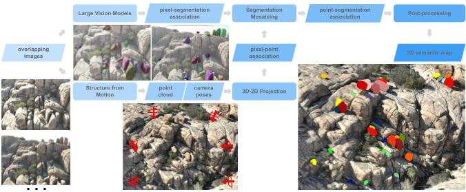
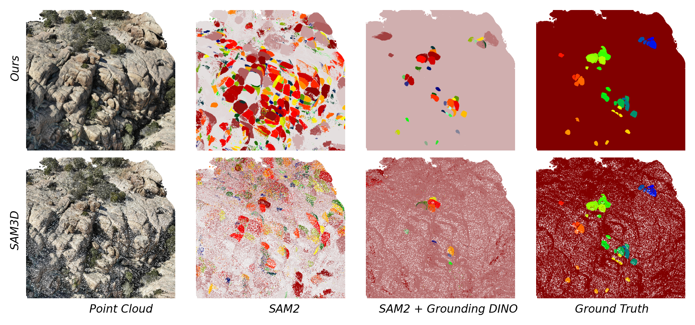

# SegMo3D: Large-scale 3D Semantic Mapping Using Structure-from-Motion and Segmentation Mosaicking Algorithms
SegMo3D is a framework designed to address challenges in large-scale 3D semantic mapping. Using overlapping images collected over environments of interest, Structure-from-Motion (SfM) produces georeferenced point clouds and estimates camera poses. Existing large vision models (LVMs) such as Segment Anything Model segment instances in the images. To achieve 3D segmentation in the point clouds, we project the points back onto the camera image planes, aligning points with the corresponding 2D segmentation. As instances are independently segmented across multiple images with different perspectives, we develop a segmentation mosaicking algorithm to associate and mosaick instances from key images in a weighted undirected graph. Our methodology is validated using both synthetic data generated by Kubric and real-world UAV-SfM data. By leveraging LVMs, our approach eliminates the need for 2D or 3D training data. Additionally, by integrating Grounding DINO, the method supports segmentation of objects of interest using text prompts, enhancing its flexibility and adaptability to varied tasks. Designed to be compatible with existing SfM software, including Agisoft and OpenDroneMap, our implementation integrates into established large-scale mapping workflow.





## **Key Features**
✅ **Seamless Integration with SfM Products**  
Compatible with **Agisoft Metashape** and **OpenDroneMap (ODM)**.  

✅ **Text-Prompt-Based Object Segmentation**  
Supports **SAM/SAM2** and **Grounding DINO** for feature selection using natural language prompts.  

✅ **Benchmarked with Kubric Dataset**  
Includes synthetic data experiments for validation.  
📌 **Kubric Data Generator Repository**: [data_generator_3d](https://github.com/ZhiangChen/data_generator_3d)  



## **Installation**
Clone the repository and install dependencies:  
```bash
git clone https://github.com/ZhiangChen/SegMo3D.git
cd SegMo3D/semantic_SfM/ssfm/
pip3 install .
```

**Hardware requirements**: This project utilizes the Segment Anything Model (SAM) for panoptic segmentation. GPUs are not required for SAM but are recommended to expedite inference speed. The other parts of this project use only CPUs. As a point cloud will be stored in memory, memory usage depends on the point cloud size. 


## **SegMo3D Architecture**
- **[files.py](./semantic_SfM/ssfm/files.py)** – Utility functions for file operations, including reading and writing point cloud and image files.  
- **[image_segmentation.py](./semantic_SfM/ssfm/image_segmentation.py)** – Implements deep learning models for instance and panoptic segmentation. (**Pixel-Segmentation Association**)  
- **[probabilistic_projection.py](./semantic_SfM/ssfm/probabilistic_projection.py)** – Projects point clouds onto image planes and creates probabilistic semantic associations. (**Pixel-Point Association**)  
- **[object_registration.py](./semantic_SfM/ssfm/object_registration.py)** – Registers objects (instances and stuff) in point clouds. (**Point-Segmentation Association** / **Segmentation Mosaicking**)  
- **[post_processing.py](./semantic_SfM/ssfm/post_processing.py)** – Provides methods for refining and cleaning segmented 3D point clouds.  


## **Supported Platforms and Models**
SegMo3D supports **SfM-derived point clouds** from the following platforms:  
- [WebODM](https://opendronemap.org/webodm/)  
- [Agisoft Metashape](https://www.agisoft.com/)  

For extracting **point clouds and camera parameters**, refer to:  
📖 **[docs/projection_tutorial.md](docs/projection_tutorial.md)**  

**Supported Image Segmentation Models:**  
- [Segment Anything Model (SAM)](https://github.com/facebookresearch/segment-anything)  
- [Segment Anything Model 2 (SAM2)](https://github.com/facebookresearch/sam2)  
- [Grounding DINO](http://github.com/IDEA-Research/GroundingDINO)  


---

## **Tutorials**
📌 **Step-by-step guides for using SegMo3D:**  
1. **Projecting Point Clouds onto Image Planes** – [docs/projection_tutorial.md](docs/projection_tutorial.md)  
2. **Camera Calibration in SfM** – [docs/camera_calibration_optimization.md](docs/camera_calibration_optimization.md)  
3. **Depth Filtering** – [docs/depth_filtering.md](docs/depth_filtering.md)  
4. **Data Structures & Algorithms for Object Registration** – [docs/object_registration.md](docs/object_registration.md)  
5. **Running a Complete Workflow Example** – [semantic_SfM/ssfm/workflow.ipynb](semantic_SfM/ssfm/workflow.ipynb)  