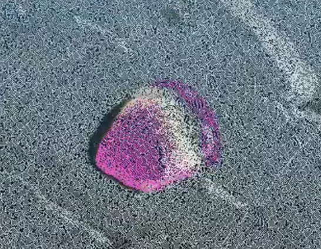
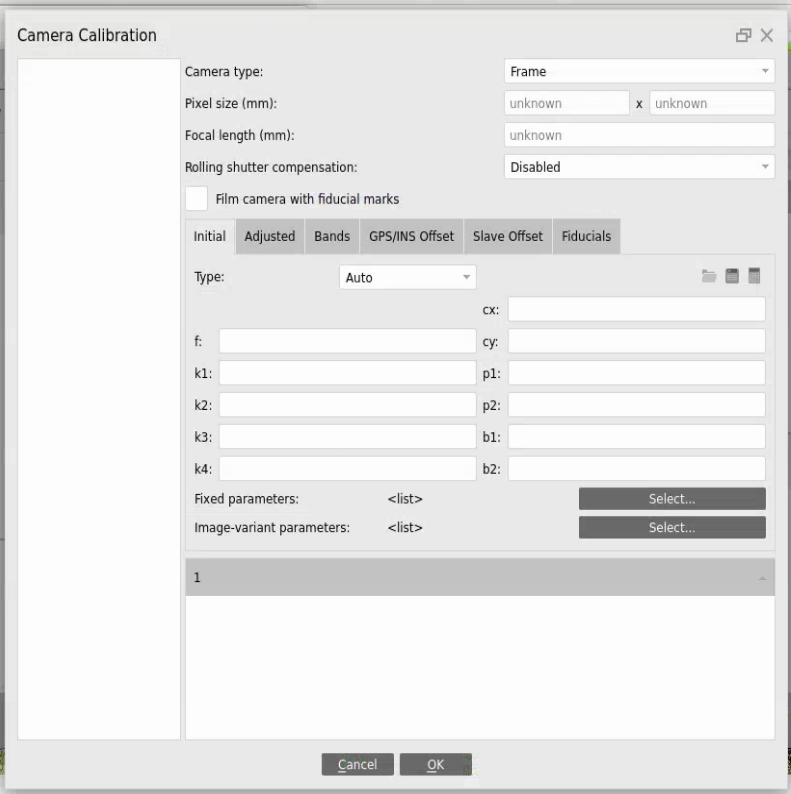
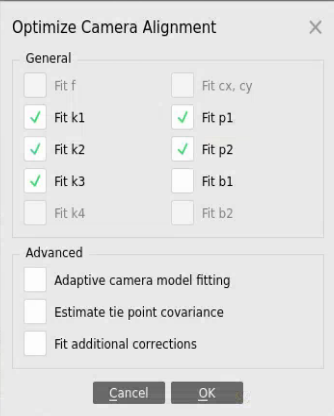

# Tutorial: Camera Calibration Optimization

Zhiang Chen, May 14, 2024

During the bundle adjustment process in SfM, cameras are automatically calibrated. From the camera calibration, we get camera intrinsic parameters and distortion parameters. However, the calibration is not always optimal, causing shifting issues of projecting semantics on point clouds, as shown in the following figure. This shift issue usually occurs when the $c_x$ or $c_y$ is too large from the calibration, no matter whether the reprojection error is small or not. (the reprojection error is calculated only using sparse points from bundle adjustment). This tutorial introduces a few approaches to optimize the camera calibration for a better result of semantic SfM. 

If you have a camera, you can use a chessboard method to calibrate the camera. There are many tools for this method: e.g., Agisoft Metashape and OpenCV. Agisoft Metashape provides a nice electric chessboard so you don't need to print one. Once the camera is calibrated, you can import the parameters in the camera calibration and fix the values before bundle adjustment. For WebODM, you can import the parameters as a json file. For Agisoft, you can use "Tool -> Camera Calibration". 

It would be trickier to optimize camera calibration if you have only photos but not the camera. WebODM automatically calibrates the camera based on the photos but does not optimize the calibration. Therefore, the calibration may not always optimized: e.g., $c_x$ and $c_y$ are small. Instead, you can manually tune the parameters using tools in Agisoft following the steps below:

- align photos: initial camera calibration
- tools -> camera calibration: only fix k1, k2, k3, p1, p2, b1, b2 
- tools -> camera optimization: only optimize f, cx, cy
- tools -> camera calibration: check adjusted f, cx, cy (usually cx, cy are small now)
- tools -> camera calibration: only fix f, cx, cy
- tools -> camera optimization: only optimize k1, k2, k3, p1, p2, b1, b2 
- export camera parameters and check if all parameters are proper

After the first camera optimization, if cx, cy are not small, you may need to repeat such separate optimization fore a few more iterations. If no improvements even after a few iterations, you may need to restart photo alignment from source or estimated. 

With proper camera calibration parameters, you can quickly verify the shift issue using probabilistic_projection.py. Sometimes, the shift cannot be fully eliminated in one image. Or shift issue may occur in other images. However, the camera calibration optimization works as long as the general shit issue is alleviated. 

In some specific applications, we have OpenCV erosion to remove the uncertainties on mask edges, which also helps the shift issue. Combining erosion with explicit background mask may achieve best performance: Background is usually labeled as -1, which is ignored in object registration; making explicit background mask means using positive labels for the original background. Additionally, probabilistic object registration also reduces the shift issue.

