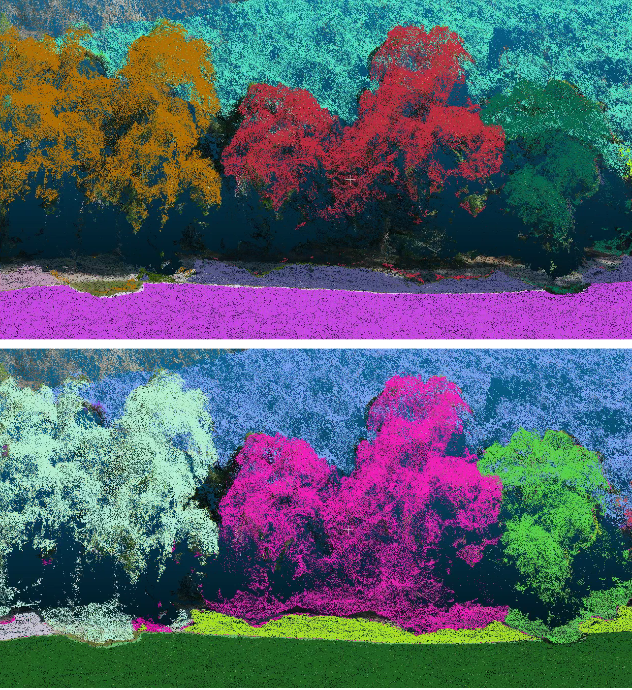

# Tutorial: Depth Rendering and Filtering

Zhiang Chen, Apr 12, 2024



Because points are sparse, when projecting a point cloud onto an image, a projective ray may penetrate many objects. For example, as shown in the bottom panel of the figure below, when projecting the point cloud onto an image from above this area and segmenting the points based on 2D image segmentation, the points on the road are misclassified as trees. This misclassification occurs because the points on the road fall into the areas of tree segmentation in the 2D image because of the sparsity of the point cloud. I address this problem by using a depth image rendered from a mesh model to filter the points that are further from the front face of the mesh. 

## Depth image rendering
The objective of depth image rendering is to generate a depth image that captures the foremost faces relative to the camera along the camera's z-axis. Initially, I export a mesh model using Agisoft in .obj format with WGS 84 / UTM georeferencing. A mesh model comprises vertices and triangular faces. For example, as illustrated below, vertices represent points in 3D space, while faces are composed of indices that connect three vertices to form a triangle.
```
Vertices:  
[[4.32923721e+05 3.74964016e+06 1.54768085e+02]
 [4.32898206e+05 3.74960091e+06 1.44520859e+02]
 [4.32919001e+05 3.74963290e+06 1.55375528e+02]
 [4.32898214e+05 3.74960093e+06 1.44517384e+02]
 [4.32910171e+05 3.74961932e+06 1.46417276e+02]]
Faces:  
[[73708 71990 73719]
 [71993 73712 72002]
 [73710 71990 73708]
 [71993 71990 73710]
 [73712 71993 73710]]
```
Compared with point clouds, mesh models are continuous in space. From the camera origin, a projective ray may hit multiple faces, but the first face it encounters is the foremost. The distance between this point and the camera origin along camera's z-axis is the depth. I wrote a script to generate a depth image from a mesh model, following this workflow ([depth_image_rendering.py](https://github.com/ZhiangChen/semantic_SfM/blob/main/semantic_SfM/ssfm/depth_image_rendering.py)):
1.  Transformation: Transform the mesh vertices from world space to camera space using the extrinsic parameters (rotation and translation).

2. Rasterization:  For each face, determine the pixels it covers on the image plane and calculate the depth of these pixels based on the vertices' depth values.

3. Edge Function: A common approach in rasterization is to use an edge function to determine if a point (pixel) is inside a triangle. This can be used to iterate over the bounding box of a triangle in the image plane and fill in the pixels that are inside the triangle.

4. Depth Interpolation: For pixels within a triangle, interpolate the depth values from the triangle's vertices. 

5. Depth Buffering (Z-Buffering): To handle occlusions, maintain a depth buffer (a 2D array the size of your output image) initialized with infinity values. For each pixel that a triangle covers, compare the interpolated depth value with the current value in the depth buffer. If it's closer to the camera, update the pixel's depth value in the depth buffer and the depth image. 

(The mesh model from WebODM (v2.4.2 at the moment) is in local coordinate system and can be transformed to UTM by adding the offsets from georeference files)

## Depth image filtering
Using the depth image generated from a mesh model, I create a depth filter to exclude points that are located beyond the foremost faces. Equivalently, this depth filter keeps only those points whose depth does not exceed a frontier. This frontier is set at a distance beyond the foremost faces, determined by a predefined threshold value:

depth_pc < depth_mesh + threshold

where depth_pc is the depth from a point cloud, depth_mesh is depth from a mesh model, and threshold is predefined parameter. The frontier is established at depth_mesh + threshold. Note that depth is the distance between a point in space and camera origin along the camera's z-axis. This can be easily implemented based on regular 3D point projection ([probabilistic_projection_depth_filtering.py](https://github.com/ZhiangChen/semantic_SfM/blob/main/semantic_SfM/ssfm/probabilistic_projection_depth_filtering.py)).


