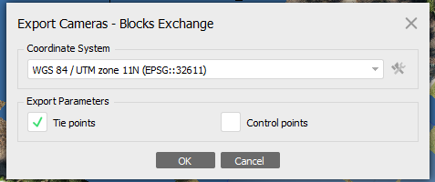
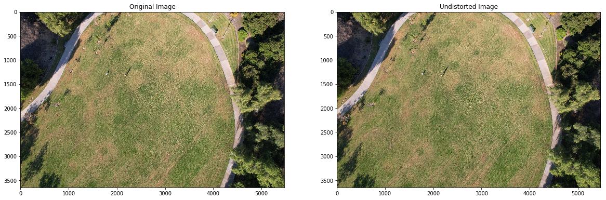
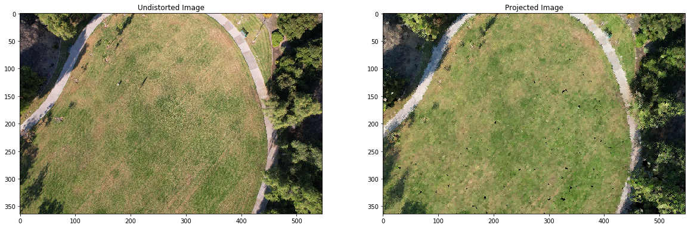

# Tutorial: Point Cloud Projection

Zhiang Chen, Nov 30, 2023

Using a collection of images, Structure from Motion (SfM) generates a point cloud, mesh model, camera poses, and camera intrinsic parameters. This tutorial outlines the steps to project the point cloud back onto an image plane and includes a corresponding [Jupyter Notebook](../semantic_SfM/ssfm/projection.ipynb) to aid in understanding the process.


## Point cloud acquisition
A point cloud can be obtained from Structure from Motion (SfM) or an SfM-derived mesh model. The point cloud or mesh model should be exported in a global metric coordinate system, such as .las for point clouds and .obj for mesh models. It is highly recommended to use the WGS 84 / UTM projection to maintain metric units. You can find UTM zones at this link: [What UTM Zone am I in?](https://mangomap.com/robertyoung/maps/69585/what-utm-zone-am-i-in-#).

CloudCompare can be used to sample point clouds from a mesh model.

## Pinhole camera projection

1. **Projection of 3D Point to Camera Coordinates:**

A 3D point $P$ in the world coordinate system can be transformed to the camera coordinate system using the extrinsic parameters (rotation $R$ and translation $t$):

$P_c = TP$

where $P = [x, y, z, 1]$ and $T=[R|t]$, which is camera extrinsic matrix. 


2. **Projection onto the Image Plane:**

The 3D point in camera coordinates is then projected onto the image plane using the intrinsic camera matrix `K`: 

$p_i = KP'_c$

where $P'_c = [x, y, z]$, $p_i = [u', v', w']$ and $K = [[f_x, 0, c_x],[0, f_y, c_y],[0, 0, 1]]$, which is camera intrinsic matrix. 

- `f_x` and `f_y` are the focal lengths expressed in pixel units. 
- `c_x` and `c_y` are the coordinates of the principal point (usually the image center). `c_x` and `c_y` translate the origin from the camera focal point (usually image center) to the top-left corner of the image. 


3. **From Homogeneous to Cartesian Coordinates:**

The projected point $p_i$ is in homogeneous coordinates $(u', v', w')$. To convert it to Cartesian coordinates (u, v) on the image plane, divide by $w'$.

4. **Point Reduction Explanation:**   

When projecting a point cloud onto an image plane, it is common for multiple points to converge into a single pixel. This convergence typically occurs for two reasons: (1) the proximity of points to one another in space, or (2) the alignment of points along a straight line relative to the perspective of the projection. In such cases, only the points nearest to the camera plane are retained in the final image. In other cases where pixels on images are not always segmented, points falling into those pixels will not have semantics, resulting in the point reduction in the segmented point cloud.  


## Camera extrinsic matrix
In Agisoft, camera extrinsic matrix can be exported to a .xml file. It is recommended to use Blocks Exchange export option with WGS 84 / UTM projection system. 



In WebODM, camera extrinsic matrix can be exported to a .geojson file. 

[ssfm/files.py](../semantic_SfM/ssfm/files.py) includes functions to read camera extrinsic matrix. 

Jointly debugging extrinsic projection and intrinsic project is difficult. Therefore, it is recommended to figure out extrinsic matrix and intrinsic matrix in sequence. 

Here are several important steps to find correct camera extrinsic matrix:

1. Translation vector should be close to the point cloud center. 

2. Find correct rotation matrix is tricky. First, project the point cloud to camera coordinates. 

3. Save transformed point cloud. 

4. Visually exam the transformed point cloud in CloudCompare. 

5. Check if the `x-y` center of the transformed point cloud is close to the center of the image (Display->show cursor coordinates). If not, the rotation matrix may need to be transposed. 

## Camera intrinsic matrix
In WebODM, the camera intrinsic matrix can be calculated from .json file. `c_x` and `c_y` in the .json file represents the normalized offsets from the image center. To get the correct $c_x$ and $c_y$ in pixel coordinates,

$c_x = width/2 + c\_x*width$  
$c_y = height/2 + c\_y*height$

The `focal_x` and `focal_y` are normalized focal length. For the DJI Air 2S camera, 

$f_x = f_y = focal\_x * width $

In Agisoft, the camera intrinsic matrix can be calculated from the same .xml file exported from Blacks Exchange format. $c_x$ and $c_y$ can be directly read from PrinciplePoint/x,y. The SensorSize and FocalLength are in millimeter. The SensorSize is the size of the width. Therefore, $f_x$ and $f_y$ can be calculated, 

$f_x = f_y = width * float(focal\_length\_mm) / float(sensor\_size\_mm)$


Debugging intrinsic matrix can be cumbersome. Here are several important steps that may help expedite the process. 

1. Save the 3D points that are projected on the image plane.

2. Exam the center and boundary of the cropped point cloud.

3. Exam the projected image. Resize the image if the orignal size is too large. The projected image may contain many black pixels because the original point cloud is sparser than image pixels. Nearest interpolation can be used to fill the black pixels. Details can be found in the tutorial [Jupyter Notebook](../semantic_SfM/ssfm/projection.ipynb). 


## Distortion correction
When inputting JPG or RAW images from UAVs to SfM, WebODM or Agisoft will automatically correct distortion during the photo alignment process (therefore, users do not need to manually implement distortion correction for WebODM or Agisoft). The distortion coefficients 

$(k_1, k_2, p_1, p_2, k_3)$

can be exported from the SfM software. 

After projecting a point cloud to a image plane, distortion correction is not needed, because I assume an ideal pinhole camera model for the projection process, which does not cause any distortion. However, distortion correction should be applied to the JPG or RAW images from UAVs, which aligns the pixels in distortion-corrected images with those in pointcloud-projected images. I suggest to have distortion correction after machine learning segmentation, because distortion correction may cause black edges to the images, which may affect segmentation results. OpenCV provides Python APIs to implement distortion correction `cv2.undistort`. This function also support multiple (more than three) channels.

The following figures show (1) the original JPG from a DJI UAV and distortion-corrected image, and (2) the distortion-corrected image and pointcloud-projected image. 




## N-d array and coordinates
```
>>> a = np.arange(15).reshape(3,5)
>>> a
array([[ 0,  1,  2,  3,  4],
       [ 5,  6,  7,  8,  9],
       [10, 11, 12, 13, 14]])
>>> a[1,3]
8
```